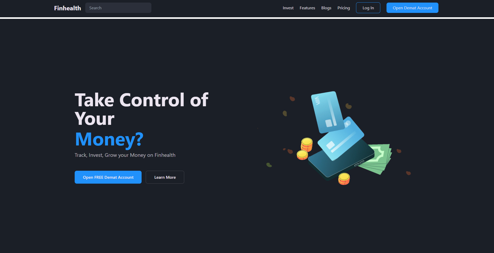
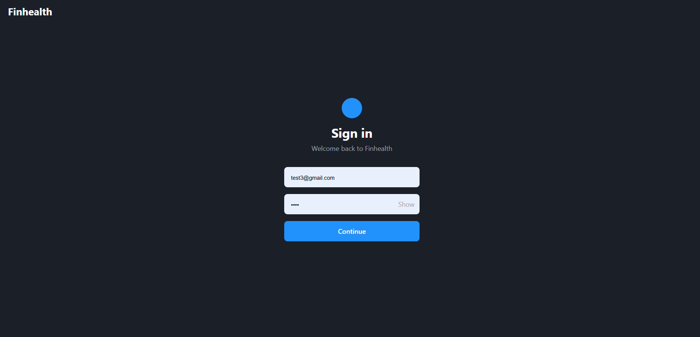

## [**Try FinHealth Now!**](https://sriramabc29.github.io/FinHealth/)

# Finhealth - A Financial Wellness and Management Ecosystem

## **Overview**
Finhealth is a cutting-edge platform designed to revolutionize how individuals manage their finances. This project, developed entirely by me, is currently in progress and aims to provide an intuitive user experience through advanced financial tools and engaging user interfaces.

---

## **Purpose**
Finhealth empowers users to take control of their financial journey by offering:
- Seamless expense tracking.
- Comprehensive financial literacy tools.
- Goal-oriented investment planning.
- Community-driven support for sustainable financial habits.

---

## **Key Features**

### 1. **Bank Account Integration**
- **Description**: Link bank accounts using APIs like Plaid or Yodlee.
- **Benefits**: Automatically import transactions, categorize expenses, and receive real-time updates.
- **Security**: OAuth 2.0 authentication and encryption protocols ensure data protection.

### 2. **Expense Tracking**
- **Features**:
  - Smart Categorization: Automatically organize expenses into predefined categories.
  - Custom Tags: Add tags for detailed tracking.
  - AI-Powered Insights: Gain actionable advice on spending patterns.
  - Budget Planner: Set limits with real-time notifications.

### 3. **Financial Health Score**
- **Score Evaluation**: Assesses spending habits, income stability, debt levels, and savings to calculate a personalized financial score.
- **Improvement Suggestions**: Offers actionable recommendations for financial growth.

### 4. **Goal-Oriented Savings**
- **Set Goals**: Define savings goals (e.g., vacations, large purchases).
- **Automated Savings**: Schedule contributions towards goals.
- **Progress Tracking**: Visualize goal achievements through dynamic indicators.

### 5. **Investment Planner**
- **Learning Tools**: Beginner-friendly tutorials on investments.
- **AI Recommendations**: Portfolio suggestions tailored to risk tolerance.
- **Portfolio Management**: Track and analyze investment performance.

### 6. **Gamified Financial Literacy**
- **Interactive Quizzes**: Learn concepts through fun challenges.
- **Rewards System**: Earn points, badges, and incentives.
- **Simulated Trading**: Practice trading in a risk-free environment.

### 7. **AI-Powered Insights**
- **Risk Alerts**: Detect potential financial risks.
- **Behavioral Nudges**: Suggestions to optimize savings and spending.

### 8. **Community Engagement**
- **Forums**: Discuss strategies and share tips.
- **Mentorship**: Connect with advisors and experienced users.

### 9. **Sustainability Integration**
- **Eco-Tracking**: Assess the carbon footprint of purchases.
- **Green Investments**: Highlight environmentally responsible options.

---

## **Project Progress**

### Current State
- **Landing Page**: Fully designed with a user-friendly interface.



- **Login Page**: Features secure authentication options.



- **User Dashboard**: Initial designs implemented with dynamic data visualization.


---

## **Technical Details**

### **Tech Stack**
- **Frontend**: React Native.
- **Backend**: Node.js with Express.js.
- **Database**: PostgreSQL.
- **AI/ML**: Python (scikit-learn/TensorFlow).

### **APIs**
- Plaid/Yodlee: Bank account integration.
- Alpha Vantage: Stock market data.
- Firebase: Notifications and authentication.

### **Security Features**
- **Data Encryption**: End-to-end encrypted transmission and storage.
- **Two-Factor Authentication**: Enhanced login security.
- **Privacy Controls**: User control over data sharing.

---

## **Getting Started**

### Prerequisites
- Install [Node.js](https://nodejs.org/).
- Install [React Native CLI](https://reactnative.dev/docs/environment-setup).

### Steps to Run Locally
1. Clone the repository:
   ```bash
   git clone https://github.com/sriramabc29/FinHealth.git
   ```
2. Navigate to the project directory:
   ```bash
   cd FinHealth
   ```
3. Install dependencies:
   ```bash
   npm install
   ```
4. Start the development server:
   ```bash
   npm start
   ```

---

## **Contact**
For questions, feedback, or collaboration, reach out to me:

- **Email**: [sriramabc30@gmail.com](mailto:sriramabc30@gmail.com)
- **LinkedIn**: [linkedin.com/in/sriramabc30](https://www.linkedin.com/in/sriramabc30/)
- **GitHub**: [github.com/sriramabc29](https://github.com/sriramabc29)

---

## **Acknowledgements**
Thank you!

